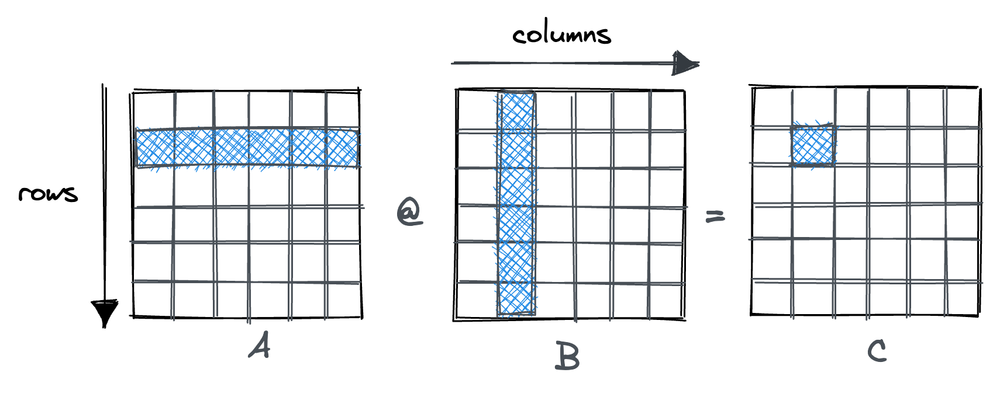

# ***matrix-multiplication***

### _2D/3D_ matrix multiplication using `python3`

In linear algebra and machine learning, matrix multiplication is a fundamental concept. 
There is many ways to add and multiply matrices mathematically and programmatically. 
Here are some implemenations purely using python.




## explicit with nested loops
```python
# Input two matrices and label them

matrix_1 = [[1,2,3],
            [4,5,6],
            [7,8,9]]
matrix_2 = [[0,1,2],
            [3,4,5],
            [6,7,8]]

# Create an empty result matrix to store the multiplication result
res = [[0 for x in range (3)] for y in range(3)]

# Use nested for loops to iterate through rows and columns of the matrices
for i in range(len(matrix_1)):
    for j in range(len(matrix_2[0])):
        for k in range(len(matrix_2)):

            # Calculate the element at row 'i' and column 'j' of the result matrix
            res[i][j] += matrix_1[i][k] * matrix_2[k][j]

# Print the resulting matrix
print(res)
```
## `numpy`
```python
import numpy as np

# Create matrices using np.arange and np.reshape which are two 3x3 matrices
matrix_1 = np.arange(1,10).reshape(3,3)

matrix_2 = np.arange(0,9).reshape(3,3)

# Calculate the dot product of matrix_1 and matrix_2 using NumPy's dot function
res = np.dot(matrix_1,matrix_2)

# Print resulting matrix
print(res)
```
## `torch`
```python
import torch

# Define two matrices as PyTorch tensors

matrix_1 = torch.tensor([[1,2,3],
                        [4,5,6],
                        [7,8,9]])

matrix_2 = torch.tensor([[0,1,2],
                        [3,4,5],
                        [6,7,8]])

# Calculate the dot product of matrix_1 and matrix_2 using .matmul()
product = torch.matmul(matrix_1, matrix_2)

# Print resulting matrix
print(product)
```
